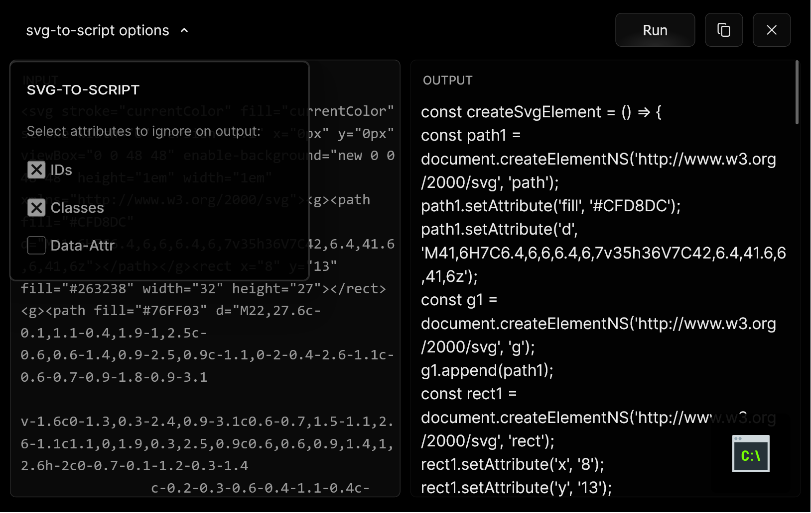
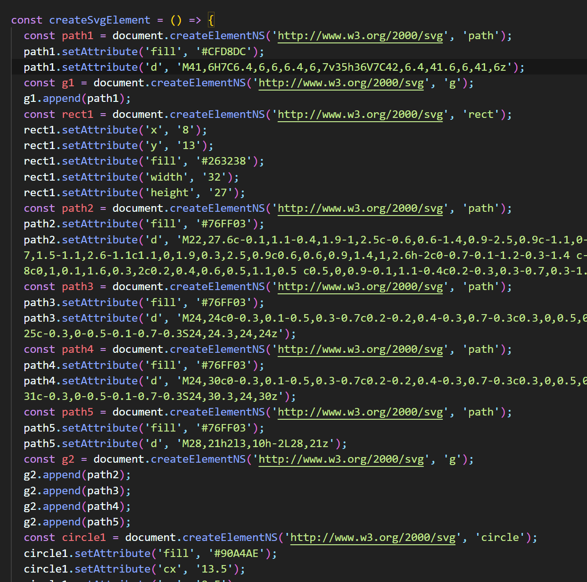

# svg-to-script

Svg-to-script parses a valid SVG string and converts it into a sequence of JavaScript commands capable of recreating the SVG element.

Options to ignore IDs/Classes/Data-Attributes

*input example*

*output example*
